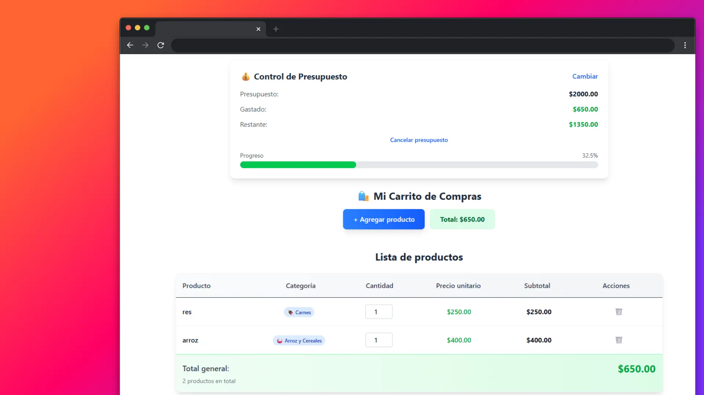

# SmartCart - Control Inteligente de Gastos

Una aplicación web moderna para controlar y gestionar tus gastos mientras compras en el supermercado. SmartCart te ayuda a mantener tu presupuesto bajo control y tomar decisiones de compra más inteligentes.



## Características Principales

### Control de Presupuesto
- Establece un presupuesto antes de comprar
- Monitoreo en tiempo real de gastos
- Alertas visuales cuando te acercas al límite
- Cálculo automático de dinero restante

### Gestión de Productos
- Agregar productos con nombre, precio, cantidad y categoría
- Editar cantidades directamente desde la tabla
- Eliminar productos del carrito
- Categorías específicas de supermercado

### Análisis de Gastos
- Gráfico visual de gastos por producto
- Identificación de productos más costosos
- Cálculo automático de totales y subtotales
- Porcentajes de gasto por producto

### Experiencia Móvil
- Diseño completamente responsive
- Botones optimizados para uso táctil
- Interfaz adaptativa para diferentes pantallas
- Fácil de usar con una sola mano

## Tecnologías Utilizadas

- **React 18** - Biblioteca de interfaz de usuario
- **Vite** - Herramienta de construcción rápida
- **Tailwind CSS** - Framework de estilos utilitarios
- **JavaScript ES6+** - Lenguaje de programación moderno

## Instalación y Uso

### Prerrequisitos
- Node.js (versión 16 o superior)
- npm o yarn

### Instalación
```bash
# Clonar el repositorio
git clone [url-del-repositorio]

# Navegar al directorio
cd notemarket

# Instalar dependencias
npm install

# Iniciar servidor de desarrollo
npm run dev
```

### Scripts Disponibles
```bash
npm run dev          # Servidor de desarrollo
npm run build        # Construir para producción
npm run preview      # Vista previa de la construcción
npm run lint         # Verificar código con ESLint
```

## Estructura del Proyecto

```
src/
├── components/
│   ├── BudgetControl.jsx    # Control de presupuesto
│   ├── FormSection.jsx      # Formulario de productos
│   ├── Table.jsx            # Tabla de productos
│   ├── ExpenseChart.jsx     # Gráfico de gastos
│   └── HeaderSection.jsx    # Encabezado de la app
├── App.jsx                  # Componente principal
├── main.jsx                 # Punto de entrada
└── index.css               # Estilos globales
```

## Funcionalidades Detalladas

### Categorías de Productos
- Frutas y Verduras
- Lácteos
- Panadería
- Carnes
- Enlatados
- Limpieza
- Snacks
- Congelados
- Arroz y Cereales

### Sistema de Alertas
- **Verde**: Menos del 80% del presupuesto usado
- **Amarillo**: Entre 80% y 99% del presupuesto usado
- **Rojo**: Presupuesto excedido

## Casos de Uso

1. **Planificación de Compras**: Establece un presupuesto antes de ir al supermercado
2. **Control en Tiempo Real**: Agrega productos mientras compras y monitorea el gasto
3. **Análisis Post-Compra**: Revisa en qué productos gastaste más dinero
4. **Gestión Familiar**: Comparte el control de gastos con otros miembros de la familia

## Contribución

Las contribuciones son bienvenidas. Para cambios importantes:

1. Fork el proyecto
2. Crea una rama para tu feature (`git checkout -b feature/AmazingFeature`)
3. Commit tus cambios (`git commit -m 'Add some AmazingFeature'`)
4. Push a la rama (`git push origin feature/AmazingFeature`)
5. Abre un Pull Request

## Licencia

Este proyecto está bajo la Licencia MIT. Ver el archivo `LICENSE` para más detalles.

## Contacto

Proyecto desarrollado como herramienta de control financiero personal para compras inteligentes en supermercados.

---

**SmartCart** - Toma el control de tus gastos, compra de manera inteligente.